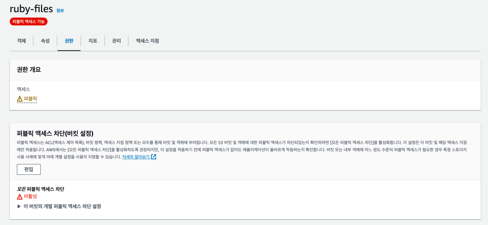

# Spring S3 Settings

### 1. 버킷의 퍼블릭 엑세스 차단 해제(퍼블릭 엑세스 허용)


### 2. 버킷 정책 설정
```yaml
{
    "Version": "2012-10-17",
    "Statement": [
        {
            "Sid": "Stmt1405592139000",
            "Effect": "Allow",
            "Principal": "*",
            "Action": "s3:*",
            "Resource": [
                "arn:aws:s3:::ruby-files/*/*",
                "arn:aws:s3:::ruby-files"
            ]
        }
    ]
}
```
*Action 설정을 통해 버킷에 대한 생성, 수정, 삭제 등의 권한을 설정*  
*Resource 설정을 통해 엑세스 할 수 있는 버킷의 범위를 설정*

### 3. S3 에 접근하기 위한 IAM 계정 생성 및 권한 정책 설정


### 4. IAM 엑세스 키 생성


### 5. application.yml 설정
```yaml
cloud:
  aws:
    s3:
      bucket: [버킷명]
    credentials:
      access-key: [엑세스 키]
      secret-key: [비밀 키]
    region:
      static: [S3 가용 지역]
      auto: false
    stack:
      auto: false
```